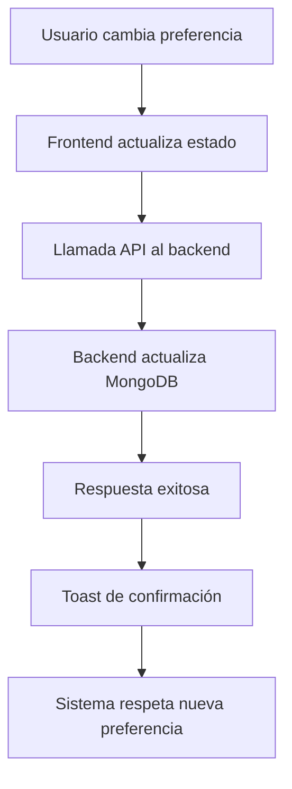

# 🔔 Sistema de Preferencias de Notificaciones

## 📋 Resumen

Se ha implementado un sistema completo de preferencias de notificaciones que permite a los usuarios controlar qué tipos de notificaciones reciben tanto en tiempo real como por email.

## ✨ Características Implementadas

### 🎛️ Preferencias de Usuario
- **Notificaciones por Email**: Control sobre notificaciones enviadas por correo electrónico
- **Notificaciones Push**: Control sobre notificaciones en tiempo real en la aplicación
- **Notificaciones de Retos**: Alertas sobre nuevos retos y duelos
- **Notificaciones de Gulag**: Alertas sobre el evento especial Gulag

### 🔧 Funcionalidades Técnicas
- **Persistencia en Base de Datos**: Las preferencias se guardan en MongoDB
- **Sincronización Frontend-Backend**: Cambios inmediatos reflejados en ambos lados
- **Validación en Tiempo Real**: El sistema respeta las preferencias al momento
- **Feedback Visual**: Toast notifications para confirmar cambios

## 🏗️ Arquitectura

### Frontend
```
📁 contexts/
├── AuthContext.tsx          # Gestión de usuario y preferencias
├── SocketContext.tsx        # Notificaciones en tiempo real
└── LanguageContext.tsx      # Traducciones

📁 pages/
└── Settings.tsx             # UI para gestionar preferencias

📁 hooks/
└── useNotification.ts       # Hook para notificaciones

📁 components/ui/
├── Toast.tsx               # Componente de notificación
└── ToastContainer.tsx      # Contenedor de notificaciones
```

### Backend
```
📁 models/
└── User.js                 # Modelo con preferencias de notificaciones

📁 routes/
└── auth.js                 # Rutas para actualizar preferencias
```

## 🎯 Tipos de Notificaciones

### 1. Notificaciones Generales
- **Trigger**: Eventos del sistema
- **Preferencia**: `notifications.push`
- **Ejemplo**: Nuevas vulnerabilidades, actualizaciones de contribuciones

### 2. Notificaciones de Retos
- **Trigger**: Nuevos retos creados
- **Preferencia**: `notifications.challenges`
- **Ejemplo**: "Se ha creado un nuevo reto: [Título]"

### 3. Notificaciones de Gulag
- **Trigger**: Eventos del Gulag
- **Preferencia**: `notifications.gulag`
- **Ejemplo**: "Se ha iniciado el evento Gulag"

### 4. Notificaciones por Email
- **Trigger**: Eventos importantes
- **Preferencia**: `notifications.email`
- **Ejemplo**: Anuncios de MVP, resultados de Gulag

## 🔄 Flujo de Datos



## 🛠️ Uso

### Para Usuarios
1. Ir a **Configuración** → **Preferencias**
2. Activar/desactivar tipos de notificaciones
3. Los cambios se aplican inmediatamente
4. Recibir feedback visual de confirmación

### Para Desarrolladores

#### Actualizar Preferencias
```typescript
const { updateNotificationPreferences } = useAuth();

const handleToggle = async (type: string, value: boolean) => {
  const success = await updateNotificationPreferences({
    [type]: value
  });
  
  if (success) {
    addNotification('success', 'Preferencias actualizadas');
  }
};
```

#### Verificar Preferencias en Socket
```typescript
// En SocketContext.tsx
if (user?.preferences?.notifications?.push) {
  // Mostrar notificación
  addNotification('info', 'Nueva notificación');
}
```

## 📊 Modelo de Datos

### Esquema de Preferencias
```javascript
preferences: {
  language: 'es' | 'en',
  theme: 'light' | 'dark',
  notifications: {
    email: boolean,      // Notificaciones por email
    push: boolean,       // Notificaciones push
    challenges: boolean, // Notificaciones de retos
    gulag: boolean       // Notificaciones de Gulag
  }
}
```

## 🌐 Traducciones

### Español
```json
{
  "settings.preferences.notifications.email": "Notificaciones por email",
  "settings.preferences.notifications.push": "Notificaciones push",
  "settings.preferences.notifications.challenges": "Retos y duelos",
  "settings.preferences.notifications.gulag": "Evento Gulag",
  "settings.preferences.notifications.saved": "Preferencias de notificaciones actualizadas.",
  "settings.preferences.notifications.error": "Error al actualizar preferencias de notificaciones."
}
```

### English
```json
{
  "settings.preferences.notifications.email": "Email notifications",
  "settings.preferences.notifications.push": "Push notifications",
  "settings.preferences.notifications.challenges": "Challenges & duels",
  "settings.preferences.notifications.gulag": "Gulag event",
  "settings.preferences.notifications.saved": "Notification preferences updated.",
  "settings.preferences.notifications.error": "Error updating notification preferences."
}
```

## 🔒 Seguridad

- **Validación**: Todas las preferencias se validan en el backend
- **Autenticación**: Solo usuarios autenticados pueden cambiar preferencias
- **Autorización**: Usuarios solo pueden cambiar sus propias preferencias
- **Logging**: Todas las actualizaciones se registran para auditoría

## 🚀 Próximas Mejoras

### Funcionalidades Adicionales
- [ ] Notificaciones de MVP
- [ ] Notificaciones de contribuciones
- [ ] Notificaciones de sistema
- [ ] Programación de notificaciones
- [ ] Notificaciones por equipo

### Mejoras Técnicas
- [ ] Cache de preferencias en Redis
- [ ] Webhooks para integraciones externas
- [ ] Métricas de engagement de notificaciones
- [ ] A/B testing de tipos de notificaciones

## 📝 Notas de Implementación

### Consideraciones de Performance
- Las preferencias se cargan una vez al inicio de sesión
- Los cambios se sincronizan inmediatamente
- No hay polling innecesario

### Compatibilidad
- Funciona con el sistema de WebSockets existente
- Compatible con el sistema de email actual
- No afecta funcionalidades existentes

### Testing
- ✅ Preferencias se guardan correctamente
- ✅ Sistema respeta preferencias en tiempo real
- ✅ Feedback visual funciona
- ✅ Traducciones completas
- ✅ Validaciones de backend

## 🎉 Conclusión

El sistema de preferencias de notificaciones está completamente implementado y funcional. Los usuarios pueden controlar su experiencia de notificaciones de manera granular, y el sistema respeta estas preferencias en tiempo real. La implementación es escalable y permite agregar fácilmente nuevos tipos de notificaciones en el futuro. 